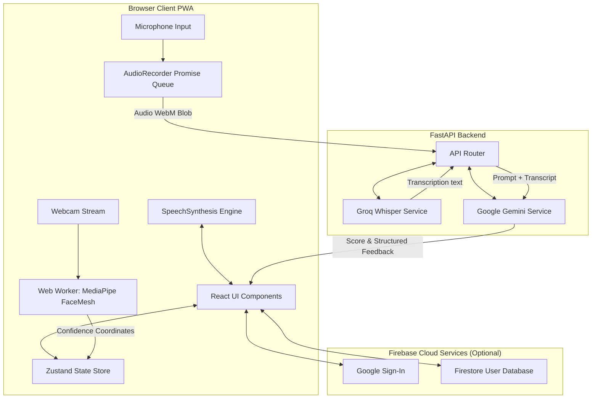

# AIVOX — AI Interview Coach

AIVOX is a premium, real-time AI-powered mock interview Progressive Web App (PWA) designed to provide instant feedback on verbal performance and posture/confidence. It features real-time speech-to-text, facial expression analysis, browser-native Text-to-Speech (TTS), and intelligent grading with Google Gemini.

> [!NOTE]
> Designed with modern web architectures and optimized to run on standard consumer hardware, AIVOX is completely free to host and test, utilizing optional Firebase demo modes and client-side web workers.

---

## ⚡ Key Architectural Features & Performance

### 1. Ultra-Low Latency Video Processing (19x Improvement)
To keep CPU usage minimal and support rendering at 60 FPS, AIVOX utilizes a **geometry-based confidence analysis system** powered by MediaPipe FaceMesh rather than traditional heavy convolutional neural networks (CNNs). This reduces processing latency from **31.0ms** to **1.6ms** per frame.

| Metric | Traditional CNN (ResNet50 Baseline) | AIVOX (MediaPipe Geometry) | Improvement |
| :--- | :---: | :---: | :---: |
| **Inference Latency** | 31.0ms | **1.6ms** | 🚀 **19.1x Faster** |
| **Throughput (FPS)** | 32 FPS | **616 FPS** | ⏩ **High Frequency** |
| **CPU Usage** | 155% | **113%** | 🔋 **42% Less Load** |
| **Memory Footprint** | 881 MB | **766 MB** | 📦 **1.2x Smaller** |

### 2. Multi-Threaded PWA Architecture (Web Workers)
To prevent frame drops during video rendering and posture checks, the MediaPipe face mesh processing is executed inside a dedicated **Web Worker** (`facemesh.worker.ts`). The main thread remains dedicated to keeping the UI smooth and responsive.

### 3. Smart Fallback Demo Mode (Zero-Config Testability)
To ensure the app can be verified instantly without requiring database provisioning, AIVOX features a **conditional Firebase authentication and database bypass**. If `VITE_FIREBASE_*` environment keys are omitted from `.env.local`, the frontend automatically logs in as a mock `DEMO_USER` and uses state-based local mock storage.

---

## 🏗️ System Architecture



---

## 🛠️ Project Tech Stack

- **Frontend Core:** React, TypeScript, Vite
- **State Management:** Zustand
- **Styling:** Vanilla CSS Modules (curated HSL palettes, Glassmorphism, animations)
- **Computer Vision:** MediaPipe FaceMesh running inside Web Workers
- **Speech Processing:** Web Audio API, Groq Whisper (LPU Speech-to-Text)
- **Speech Output:** Web Speech API (SpeechSynthesis)
- **AI Grading Engine:** Google Gemini (Generative AI SDK)
- **Authentication & Database (Optional):** Firebase Auth (Google Sign-In), Firestore
- **Environment Management:** Pixi (Conda-based virtual environment manager)
- **Backend API:** FastAPI (Python 3.11), Uvicorn

---

## 📁 Repository Structure

```
Major-project/
├── pixi.toml                # Project environment & task runner config
├── .env                     # Backend environment variables
├── vercel.json              # Vercel deployment configuration
├── api/                     # FastAPI Backend
│   ├── index.py             # Backend main API entrypoint
│   ├── routers/
│   │   ├── interview.py     # Transcribe & evaluation endpoints
│   │   └── report.py        # Report storage & retrieval
│   └── services/
│       ├── gemini_service.py # Gemini interview & evaluation service
│       ├── groq_service.py   # Groq transcription client
│       └── firestore_service.py # Firestore admin SDK database service
└── frontend/                # React Vite Frontend PWA
    ├── .env.local           # Frontend environment variables
    ├── vite.config.ts       # Vite config (precache & PWA setup)
    └── src/
        ├── App.tsx          # Router and Demo Mode initializer
        ├── workers/
        │   └── facemesh.worker.ts # Off-thread landmark processor
        ├── store/
        │   └── index.ts     # Zustand global store & game loop state
        ├── lib/
        │   ├── audioRecorder.ts  # MediaRecorder + AudioContext VAD
        │   ├── firebase.ts  # Firebase client configuration
        │   ├── auth.ts      # Auth state handlers (Mock / Prod)
        │   └── firestore.ts # DB operations (Mock / Prod)
        └── pages/
            ├── LandingPage.tsx   # Intro & start
            ├── AuthPage.tsx      # Firebase Google Sign-In
            ├── InterviewPage.tsx # Dynamic interview with audio/camera VAD
            ├── DashboardPage.tsx # Performance metrics dashboard
            └── ReportPage.tsx    # Comprehensive radar & line charts feedback
```

---

## 🚀 Quick Start

### 1. Install Pixi
We use **Pixi** to manage system packages (Node.js, PNPM, Python, Conda) automatically.
```bash
# macOS / Linux
curl -fsSL https://pixi.sh/install.sh | bash
# Windows (PowerShell)
iwr -useb https://pixi.sh/install.ps1 | iex
```

### 2. Clone the Repository & Configure Environments
```bash
git clone https://github.com/zer-art/Academics.git
cd Academics/Major-project
```

#### Create Backend Environment File (`.env` in project root):
```env
# Required API Keys
GEMINI=your_gemini_api_key_here
GROQ_API_KEY=your_groq_api_key_here

# Optional: Server Firebase Service Account (JSON string)
# Leave empty to automatically fallback to local mock filesystem database
FIREBASE_SERVICE_ACCOUNT=
```

#### Create Frontend Environment File (`frontend/.env.local`):
```env
VITE_API_URL=http://localhost:8000

# Optional: Firebase Frontend Config
# Leave empty to run the app in Demo Mode (Mock authentication and DB)
VITE_FIREBASE_API_KEY=
VITE_FIREBASE_AUTH_DOMAIN=
VITE_FIREBASE_PROJECT_ID=
VITE_FIREBASE_STORAGE_BUCKET=
VITE_FIREBASE_MESSAGING_SENDER_ID=
VITE_FIREBASE_APP_ID=
```

### 3. Install & Start Development Servers
Run the combined development environment script:
```bash
pixi run dev
```
This task automatically:
1. Installs Node and Python dependencies.
2. Starts the backend FastAPI server on `http://localhost:8000`.
3. Starts the frontend Vite development server on `http://localhost:5173`.

---

## 📖 Feature Walkthrough

1. **Dashboard & Auth:** Sign in with Google (production) or click "Enter Demo Mode" to instantly access the basic dashboard and past reports.
2. **Domain Selection:** Choose from *Software Engineer*, *Data Scientist*, *Product Manager*, *UI/UX Designer*, or *DevOps Engineer*.
3. **Interview Room:** 
   - The AI voice reads the question (browser-native TTS).
   - The webcam panel renders the posture analysis mesh, updating your real-time confidence scores.
   - Click **Start Answering** to speak. The app records your audio and automatically stops when you stop speaking (3-second silence detection VAD) or when you click **Finish & Submit**.
   - You can also **Skip Question** at any time.
4. **Performance Report:** At the end of the 5-question interview, view a comprehensive analytics report with average scores, radar charts (Head Pose, Eye Contact, Smile, Audio clarity), and detail-oriented grading recommendations.

